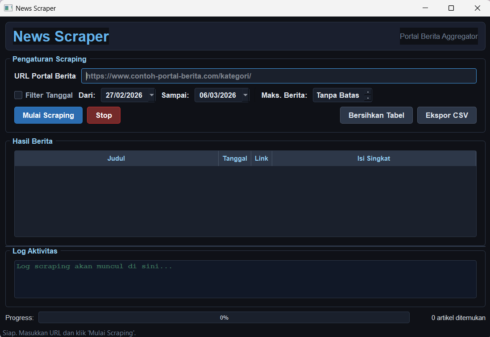
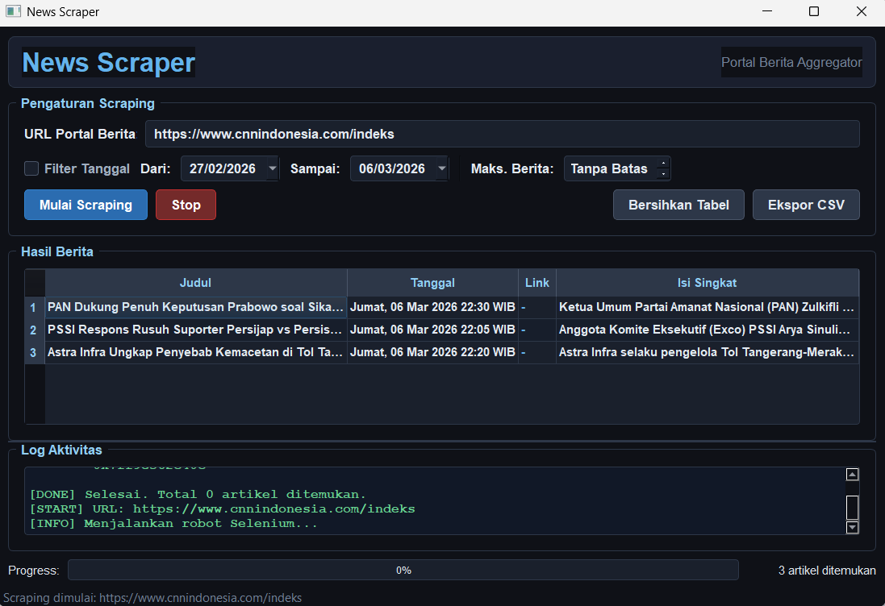
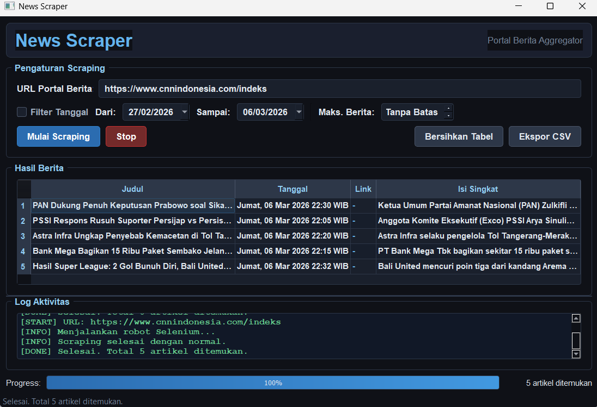

# 📰 Portal Berita Aggregator (News Scraper GUI)

Aplikasi **Portal Berita Aggregator** adalah aplikasi berbasis Python yang digunakan untuk melakukan scraping berita dari portal berita online.  
Aplikasi ini dilengkapi dengan **Graphical User Interface (GUI)** sehingga pengguna dapat mengambil data berita dengan mudah tanpa harus menggunakan command line.

Program ini mengambil informasi berita seperti **judul, tanggal, dan link artikel**, kemudian menampilkannya dalam tabel dan dapat diekspor menjadi file **CSV**.

---

## ✨ Fitur Aplikasi

- Mengambil data berita dari portal berita online
- Menampilkan hasil scraping dalam bentuk tabel
- Progress bar untuk menunjukkan proses scraping
- Log aktivitas scraping
- Pembatas jumlah berita yang diambil (limit)
- Filter berdasarkan rentang tanggal
- Export hasil scraping ke file **CSV**

---

## 🛠️ Teknologi yang Digunakan

Aplikasi ini dibuat menggunakan beberapa library Python:

- **Python**
- **PyQt5** → Untuk membuat GUI
- **Selenium** → Untuk melakukan web scraping
- **Pandas** → Untuk mengolah data dan export CSV

---

## 📂 Struktur Project

portal-berita-aggregator/
│
├── main.py # File utama untuk menjalankan aplikasi
├── gui.py # Implementasi tampilan GUI
├── scraper.py # Logika scraping berita
├── requirements.txt # Daftar library yang dibutuhkan
├── .gitignore
│
└── screenshots/ # Folder dokumentasi tampilan aplikasi GUI

---

## ⚙️ Instalasi

1. Clone repository ini
git clone https://github.com/GheviraAlviani/tugas-web-scraping-gui.git

2. Masuk ke folder project

3. Install dependencies
pip install -r requirements.txt

4. Pastikan **Google Chrome** dan **ChromeDriver** sudah terinstall.

Download ChromeDriver:
https://chromedriver.chromium.org/downloads

---

## ▶️ Cara Menjalankan Program

Jalankan file berikut:
python main.py

Setelah itu GUI aplikasi akan muncul dan siap digunakan.

---

## 📊 Cara Menggunakan Aplikasi

1. Masukkan **URL portal berita**
2. Tentukan **jumlah berita yang ingin diambil**
3. (Opsional) pilih **rentang tanggal**
4. Klik tombol **Start Scraping**
5. Hasil berita akan muncul di tabel
6. Klik **Export CSV** untuk menyimpan hasil

---

## 🖼️ Tampilan Aplikasi

### Tampilan GUI

### Proses Scraping

### Hasil Scraping

